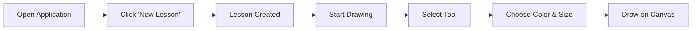
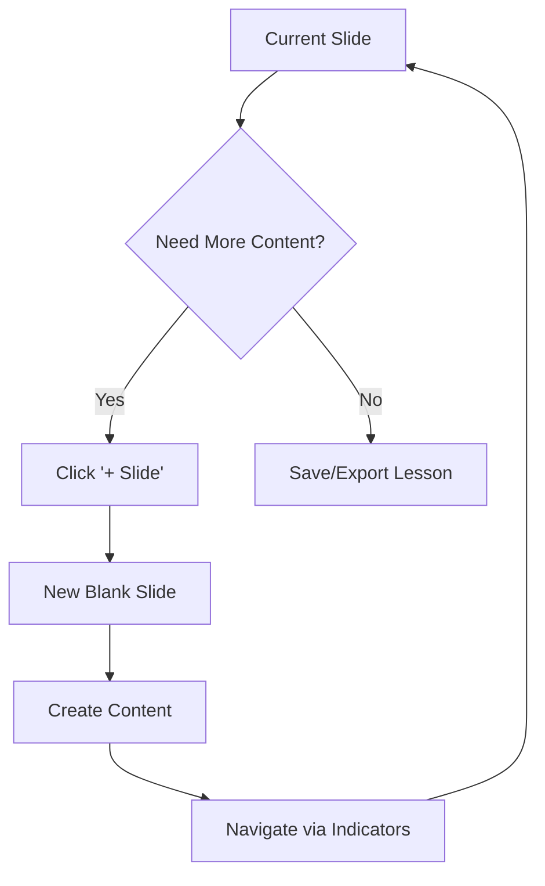
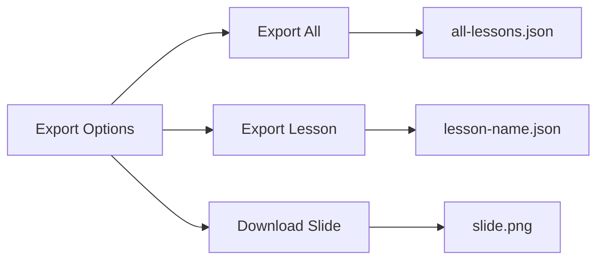
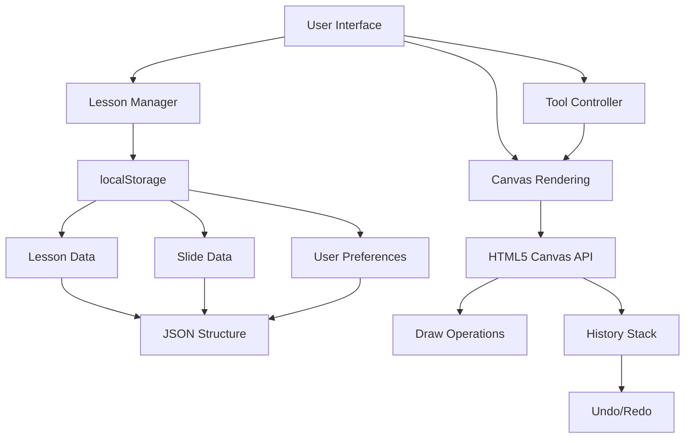

# xsukax Smart Board

[](https://xsukax.github.io/xsukax-Smart-Board)
[](LICENSE)
[](https://github.com/xsukax/xsukax-Smart-Board)

A powerful, privacy-focused interactive whiteboard application designed for educators, presenters, and creative professionals. xsukax Smart Board provides a complete digital teaching and presentation platform that runs entirely in your browser with no server dependencies or data collection.

## 🎯 Project Overview

xsukax Smart Board is a feature-rich, web-based whiteboard application that enables users to create, manage, and present interactive lessons with multiple slides. Built as a single-page application using vanilla JavaScript and HTML5 Canvas, it offers professional-grade drawing tools, lesson management capabilities, and a responsive interface optimized for both desktop and touch devices.

The application supports comprehensive lesson organization with unlimited slides per lesson, full drawing capabilities including freehand, shapes, and text, complete undo/redo history, and seamless import/export functionality for lesson sharing and backup.

## 🔒 Security and Privacy Benefits

xsukax Smart Board prioritizes user privacy and data security through several key design decisions:

### Local-First Architecture
All data is stored exclusively in the browser's localStorage, ensuring complete data sovereignty. No information is transmitted to external servers, eliminating risks associated with cloud storage, data breaches, and unauthorized access.

### Zero Data Collection
The application collects no telemetry, analytics, or user behavior data. Your lessons, drawings, and creative work remain entirely private and under your control.

### Offline Functionality
Complete functionality without internet connectivity (after initial page load). This ensures your work continues uninterrupted regardless of network availability and prevents any potential data leakage through network requests.

### No Authentication Required
No user accounts, passwords, or personal information needed. This eliminates risks associated with credential theft, account compromise, and identity exposure.

### Open Source Transparency
Full source code visibility allows security audits and verification of privacy claims. Users and security professionals can inspect the codebase to confirm no hidden tracking or data collection mechanisms exist.

### Client-Side Processing
All rendering, storage, and computation occur locally in your browser. This architecture ensures sensitive educational content or proprietary information never leaves your device.

## ✨ Features and Advantages

### Comprehensive Drawing Tools
- **Multiple Tools**: Pen, eraser, text, line, rectangle, and circle drawing capabilities
- **Customizable Styling**: Adjustable brush sizes (1-50px) and six preset colors
- **Professional Grid**: Optional grid overlay for precise alignment and technical drawings
- **Touch Support**: Fully responsive touch interface for tablets and touch-enabled devices

### Lesson Management
- **Unlimited Lessons**: Create and organize multiple lesson plans with descriptive names
- **Multi-Slide Support**: Add unlimited slides per lesson for comprehensive presentations
- **Slide Navigation**: Quick navigation between slides with visual indicators
- **Touch Gestures**: Swipe left/right to navigate slides on touch devices

### History and Undo
- **50-Step History**: Comprehensive undo/redo system tracking up to 50 actions
- **Keyboard Shortcuts**: Standard Ctrl+Z (undo) and Ctrl+Y (redo) support
- **Non-Destructive Editing**: Safe experimentation with full reversion capabilities

### Data Portability
- **Export All Lessons**: JSON export of entire lesson library for backup
- **Export Individual Lessons**: Share specific lessons with colleagues or students
- **Import Functionality**: Restore backups or import lessons from other users
- **Image Export**: Download individual slides as PNG images for documentation

### User Experience
- **GitHub-Inspired Design**: Professional, familiar interface with clean aesthetics
- **Responsive Layout**: Optimized for desktop, tablet, and mobile devices
- **Fullscreen Mode**: Distraction-free presentation and drawing experience
- **Auto-Save**: Automatic saving every 10 seconds prevents data loss
- **Visual Feedback**: Toast notifications confirm all user actions

## 📦 Installation Instructions

xsukax Smart Board requires no installation process. Follow these simple steps to get started:

### Method 1: Direct Access (Recommended)
1. Visit the live demo: [https://xsukax.github.io/xsukax-Smart-Board](https://xsukax.github.io/xsukax-Smart-Board)
2. Start creating immediately - no setup required

### Method 2: Self-Hosted Deployment
1. Clone the repository:
   ```bash
   git clone https://github.com/xsukax/xsukax-Smart-Board.git
   ```

2. Navigate to the project directory:
   ```bash
   cd xsukax-Smart-Board
   ```

3. Open `index.html` in any modern web browser:
   ```bash
   # Linux/macOS
   open index.html
   
   # Windows
   start index.html
   ```

### Method 3: Local Web Server
For enhanced compatibility and testing, serve via a local web server:

```bash
# Using Python 3
python -m http.server 8000

# Using Node.js http-server
npx http-server -p 8000

# Using PHP
php -S localhost:8000
```

Then navigate to `http://localhost:8000` in your browser.

### Browser Requirements
- **Recommended**: Chrome 90+, Firefox 88+, Safari 14+, Edge 90+
- **Required Features**: HTML5 Canvas, localStorage, ES6 JavaScript support
- **Note**: Internet Explorer is not supported

## 📘 Usage Guide

### Getting Started

#### Creating Your First Lesson



1. **Launch Application**: Open the application in your web browser
2. **Create Lesson**: Click "New Lesson" button in the header
3. **Name Your Lesson**: The default name "Lesson N" can be changed via the "Lessons" menu
4. **Start Creating**: Your first slide is automatically created and ready to use

#### Drawing and Editing

**Selecting Tools**:
- Click any tool button in the toolbar (Pen, Eraser, Text, Line, Rectangle, Circle)
- Active tool is highlighted with blue background

**Customizing Appearance**:
- Adjust brush size using the slider (1-50 pixels)
- Select color by clicking color buttons
- Active color is indicated by blue border

**Drawing Workflow**:
1. **Freehand Drawing**: Select Pen tool and draw directly on canvas
2. **Shapes**: Select shape tool, click to set start point, drag to define size
3. **Text**: Select Text tool, click position, enter text in prompt
4. **Erasing**: Select Eraser tool and drag over content to remove

### Advanced Features

#### Multi-Slide Presentations



**Adding Slides**:
- Click "+ Slide" button to create new slide
- Current slide is automatically saved
- Navigate using slide indicators at bottom center

**Slide Navigation**:
- **Click**: Click any slide indicator to jump to that slide
- **Swipe** (Touch Devices): Swipe left for next slide, right for previous
- **Indicators**: Dots at bottom show total slides and current position

#### Lesson Management

**Viewing All Lessons**:
1. Click "Lessons" button in header
2. View list of all saved lessons with metadata
3. Actions available: Open, Rename, Delete

**Renaming Lessons**:
1. In Lessons menu, click "Rename" next to desired lesson
2. Enter new name in dialog
3. Click "Save" to confirm

**Switching Between Lessons**:
1. Open Lessons menu
2. Click "Open" next to desired lesson
3. Current work is automatically saved before switching

#### Import/Export Operations

**Exporting Data**:



- **Export All**: Creates JSON file containing all lessons for complete backup
- **Export Lesson**: Exports currently active lesson for sharing
- **Download Slide**: Saves current slide as PNG image

**Importing Data**:
1. Click "Import" button
2. Select previously exported JSON file
3. Data is merged with existing lessons (duplicates are updated)

#### Keyboard Shortcuts

| Shortcut | Action |
|----------|--------|
| `Ctrl+Z` / `Cmd+Z` | Undo last action |
| `Ctrl+Y` / `Cmd+Shift+Z` | Redo action |
| `F11` (or Fullscreen button) | Toggle fullscreen mode |

### Best Practices

**Organizing Lessons**:
- Use descriptive lesson names (e.g., "Biology Chapter 3", "Q4 Sales Presentation")
- Export lessons regularly for backup
- Keep related slides in same lesson for easier navigation

**Drawing Tips**:
- Enable grid for technical drawings requiring precision
- Use larger brush sizes (10-20px) for presentation boards visible from distance
- Combine tools: draw shapes with pen tool, add text for labels
- Utilize undo frequently - experiment without fear

**Data Management**:
- Export all lessons monthly for backup
- Before major edits, export current state
- Use "Download Slide" to create image archives of important content

### Application Architecture



## 📄 License

This project is licensed under the GNU General Public License v3.0.

## 🤝 Contributing

Contributions are welcome! Please feel free to submit pull requests, report bugs, or suggest new features through the GitHub issue tracker.

## 🔗 Links

- **Live Demo**: [https://xsukax.github.io/xsukax-Smart-Board](https://xsukax.github.io/xsukax-Smart-Board)
- **Repository**: [https://github.com/xsukax/xsukax-Smart-Board](https://github.com/xsukax/xsukax-Smart-Board)
- **Issues**: [Report Bug or Request Feature](https://github.com/xsukax/xsukax-Smart-Board/issues)

## 💡 Use Cases

- **Education**: Create interactive lessons for remote or in-person teaching
- **Presentations**: Develop multi-slide presentations with drawings and annotations
- **Brainstorming**: Collaborative whiteboarding sessions (export/import for sharing)
- **Technical Documentation**: Create diagrams and annotated technical drawings
- **Art and Design**: Digital sketching and concept development

---

**Built with privacy in mind. Your data stays yours.**
